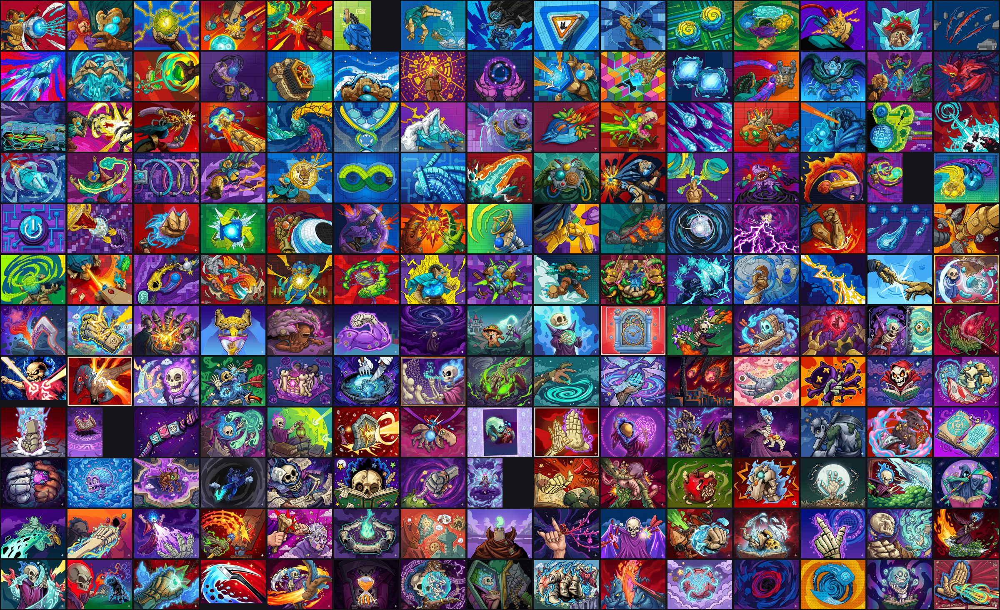

# Card Art Pack (Slay the Spire 2)

Custom card art for Slay the Spire 2: 180 new card pictures, covering every Defect card (88) and every
Necrobinder card (88), plus 3 token cards and 1 status card.



**Download:** the `sts2-card-art-v1` zip on the Releases page (about 560 MB). It holds the `NewArtwork`
folder.

**Needs the Card Art Editor mod by ysg05:** https://www.nexusmods.com/slaythespire2/mods/293
That mod isn't included here; it's their work, so get it from its own page.

```
INSTALL
1. Install Card Art Editor from Nexus (link above). It makes the folder
   Slay the Spire 2\mods\card_art_editor
   (Steam > right-click the game > Manage > Browse local files to find the game folder).
2. Put the "NewArtwork" folder from this zip inside that "card_art_editor" folder.
   If it asks, replace the existing files.
3. Start the game. The new art shows on the cards.

Each picture comes as a pair: <card>_png.png is the picture the game shows, <card>_png_source.png is
the full-size original the editor keeps for re-cropping. Keep both.
```
